# Terraform IaC + CI/CD Pipeline — Ubuntu Retail Web Platform

> I rebuilt a hand-clicked AWS environment as **Terraform**, put it behind a **GitHub Actions CI/CD pipeline** that authenticates to AWS with **OIDC (no stored access keys)**, and made every infrastructure change a peer-reviewed, security-scanned pull request. The whole environment stands up with `terraform apply` and tears down to **$0.00** with `terraform destroy` — reproducible, version-controlled, and auditable. Along the way I hit an OIDC `AccessDenied` that every config check said shouldn't happen, and traced it through CloudTrail to a GitHub security feature — [that debugging story is here](docs/debugging-journey.md).

**Author:** Michael Chileshe · [LinkedIn](https://www.linkedin.com/in/michael-chileshe-3b6215403)
**Stack:** Terraform (AWS provider ~> 5), S3 remote state with native locking, GitHub Actions, OIDC keyless auth, TFLint, Checkov, pre-commit

---

## The problem I set out to solve

Ubuntu Retail's environment — like most of the AWS work I'd done before this — was built by clicking through the console. It worked, but an auditor's question exposed the gap: *"Show me how production is defined, who changed it last, and prove you can rebuild it exactly."* With click-ops there's no answer — no source of truth, no change history, no reproducibility. One person's memory *is* the documentation.

So I rebuilt the environment as **infrastructure as code**: the whole stack is now defined in Terraform, and every change flows through a pipeline that reviews, scans, plans, and applies it. The infrastructure has a Git history, a diff on every change, and a one-command rebuild. That's the difference between "it's running" and "it's engineered."

This is the IaC re-platform of the same Ubuntu Retail Group whose migration I assessed in `aws-migration-readiness-assessment` and whose three-tier app I built by hand in `saa-three-tier-web-app` — this project takes that hand-built posture and makes it reproducible.

---

## What the code provisions

A small but complete web platform, defined entirely in the [`modules/webapp`](modules/webapp) module and called from the root:

- A **VPC** with a public subnet, internet gateway, and route table
- A **security group** (HTTP open, SSH restricted to my IP via the `admin_cidr` variable)
- An **EC2 web server** (Amazon Linux 2023, IMDSv2 required, encrypted root volume) serving a page that proves it was deployed by Terraform
- A **private, versioned, encrypted S3 bucket** for assets

None of it is expensive (free-tier EC2, negligible S3), and all of it is reproducible.

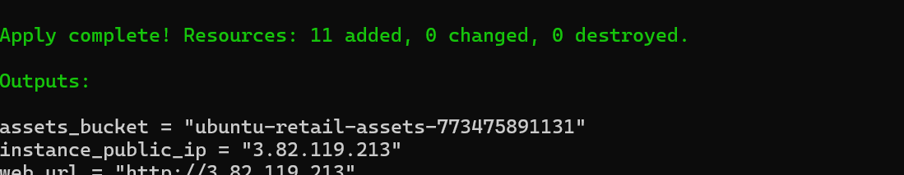

---

## The engineering that makes it more than "some .tf files"

**Remote state with native locking.** State lives in an encrypted, versioned S3 bucket with Terraform 1.10 **native S3 state locking** (`use_lockfile = true`) — no separate DynamoDB lock table. Two people (or a person and the pipeline) can't corrupt state by applying at once.

**A reusable module.** The infrastructure is a module, not a flat blob — a second environment is a second `module` block with different inputs, not a copy-paste. The module declares its own `required_version` and provider constraints so it stands on its own.

**Keyless CI/CD with OIDC.** The [pipeline](.github/workflows/terraform.yml) authenticates to AWS by exchanging a short-lived GitHub OIDC token for temporary credentials via an IAM role whose trust policy is scoped to *this repo only*. There are **no AWS access keys stored in GitHub** — nothing to leak or rotate. The OIDC provider and role are themselves defined in Terraform ([`bootstrap`](bootstrap)).

**A real PR workflow.** On every pull request the pipeline runs `terraform fmt -check`, `validate`, **TFLint**, a **Checkov** security scan, and `terraform plan` — then posts the plan as a comment on the PR, so the exact diff is reviewed before anything changes. `terraform apply` runs only after the PR merges to `main`. That's the auditable trail the auditor asked for.

**Local guardrails.** [`pre-commit`](.pre-commit-config.yaml) hooks run fmt/validate/tflint on every commit, so mistakes never even reach a PR.

---

## Architecture

```
   Developer ──PR──▶ GitHub ──▶ GitHub Actions pipeline
                                   │  (OIDC: no stored keys)
                                   ▼
                        assume IAM role (scoped to this repo)
                                   │
             fmt · validate · tflint · checkov · plan  ── comment on PR
                                   │  (on merge to main)
                                   ▼
                              terraform apply
                                   │
                    ┌──────────────┼───────────────┐
                    ▼              ▼                ▼
                  VPC +        EC2 web         private S3
                  subnet/IGW   (AL2023)        assets bucket
                    └── state in S3 (encrypted, versioned, native lock) ──┘
```

Full write-ups: the [pipeline](docs/pipeline.md) and the [architecture](docs/architecture.md).

---

## How I built it

Screenshots in [`docs/screenshots/`](docs/screenshots).

### 1. Toolchain (WSL)
Terraform, AWS CLI v2, TFLint, Checkov, and pre-commit, all on WSL. Checkov and pre-commit went in via `pipx` (modern Ubuntu blocks `pip install` into the system Python under PEP 668), and TFLint from its release binary.

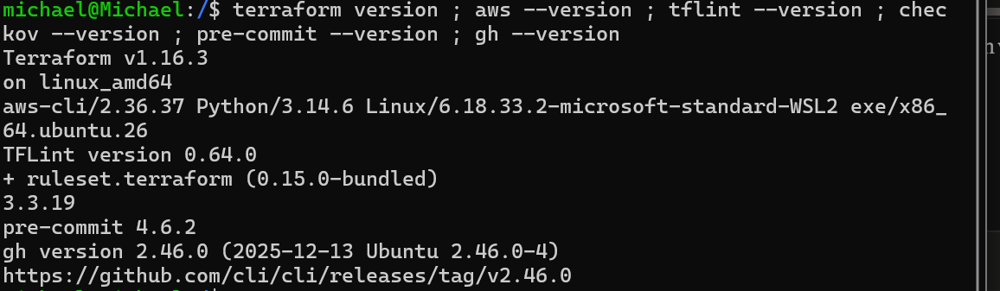

### 2. Bootstrap — state bucket + OIDC role (run once, local state)
The [`bootstrap`](bootstrap) config is a deliberate chicken-and-egg solution: it can't use the remote backend because it's what *creates* the backend, so its own state stays local. It stands up the encrypted state bucket, the GitHub OIDC provider (thumbprint fetched live, never hardcoded), and the IAM role the pipeline assumes.

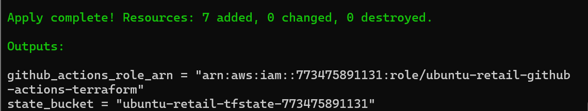

### 3. Local guardrails — pre-commit
Installing the hooks caught a real gap on the first run: TFLint flagged that the `modules/webapp` module didn't declare its own version constraints. I added a `versions.tf` to the module and the run went green — exactly the point of the hook (catch it locally, before a PR).

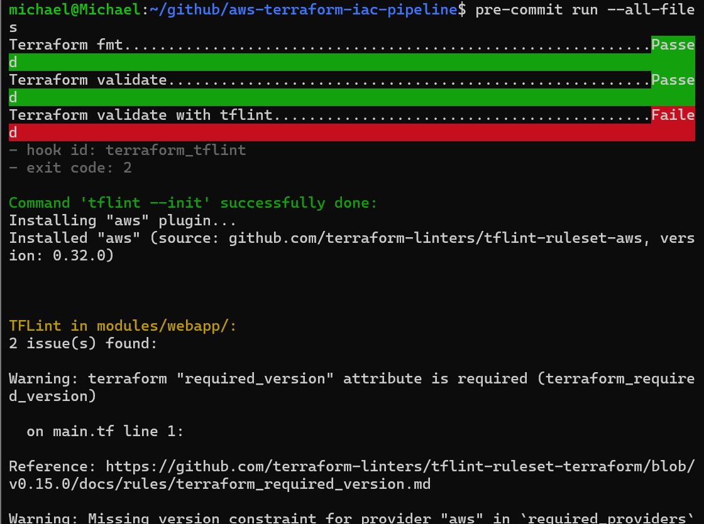
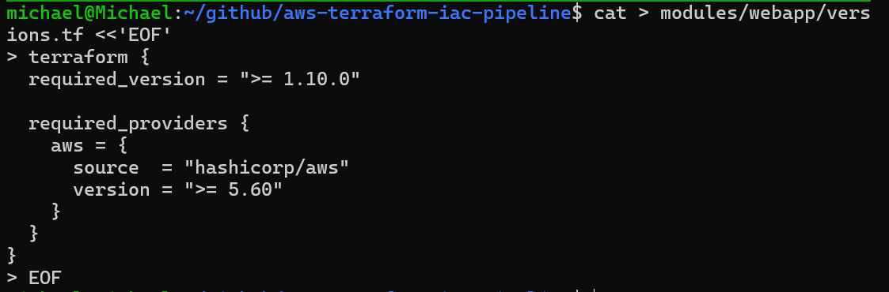
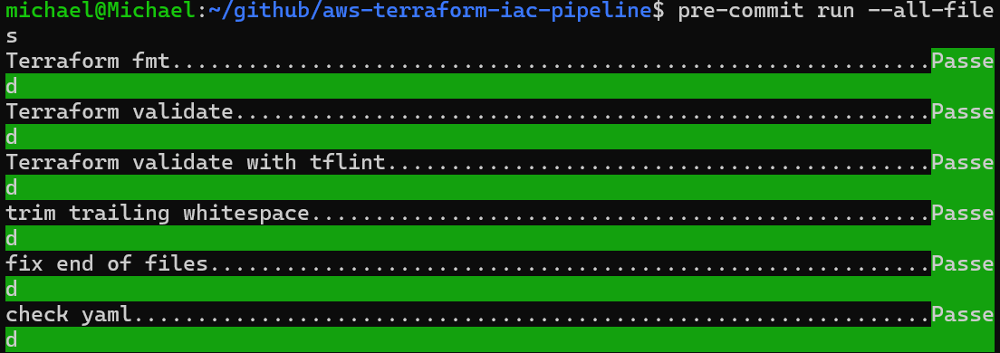

### 4. Wire the pipeline
Created the repo, stored my IP as the `ADMIN_CIDR` repository variable (so no IP is ever committed to git — the pipeline injects it as `TF_VAR_admin_cidr`), and pushed `main`.

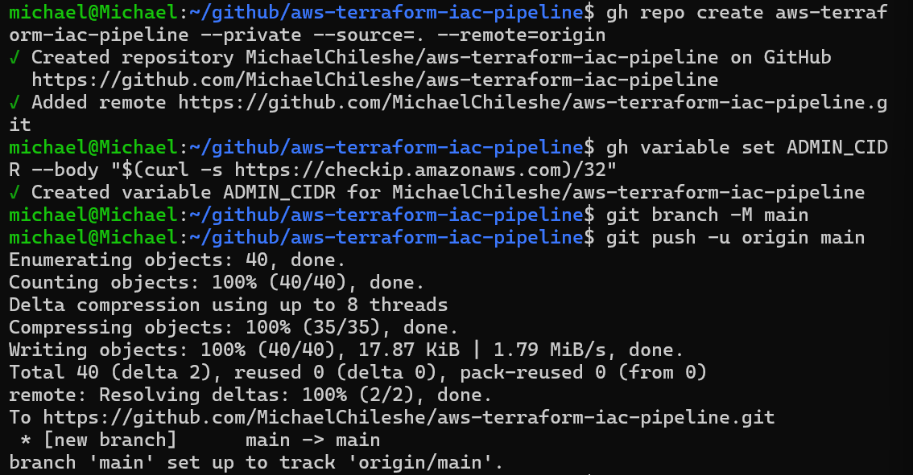
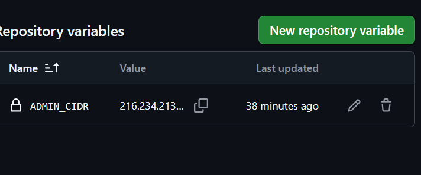

---

## The OIDC debugging journey

The first pipeline run failed on the single most important step — exchanging the OIDC token for AWS credentials — with `Not authorized to perform sts:AssumeRoleWithWebIdentity`. Every field I could inspect was correct. I traced it through **CloudTrail** to discover my account enforces **immutable OIDC subjects**, which embed numeric owner/repo IDs into the token's `sub` that my name-based trust policy never matched. The fix pinned the trust policy to the immutable format — leaving it *more* secure than where it started.


**The full write-up — how I ruled out each layer and used CloudTrail as the primary evidence — is in [docs/debugging-journey.md](docs/debugging-journey.md).** It's the part of this project I'd most want to talk through.

---

## Proving the pipeline — plan on PR, apply on merge

With OIDC fixed, I proved the review flow end to end: a change on a branch (adding a `CostCenter` tag to `default_tags`), opened as a PR. The pipeline ran fmt/validate/tflint/checkov/plan and reported back on the PR; `apply` only ran after merge.

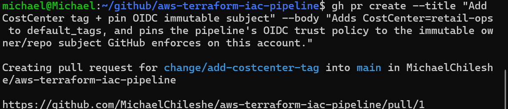
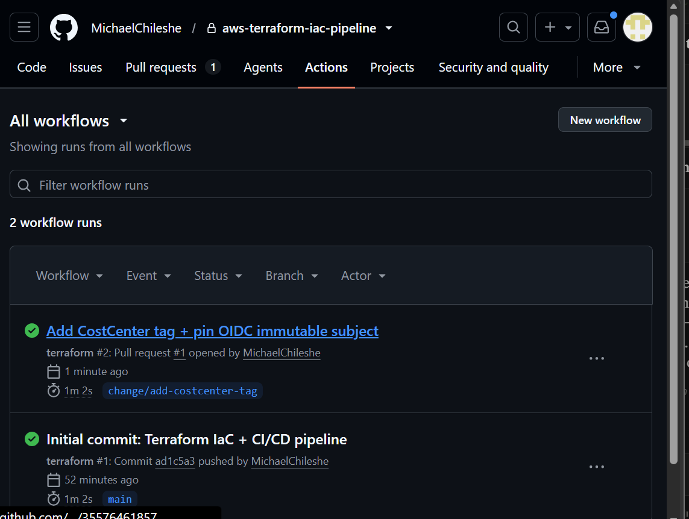
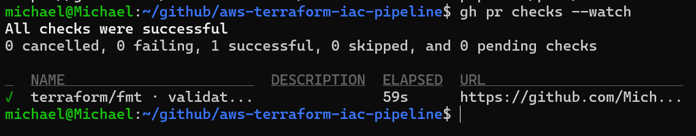
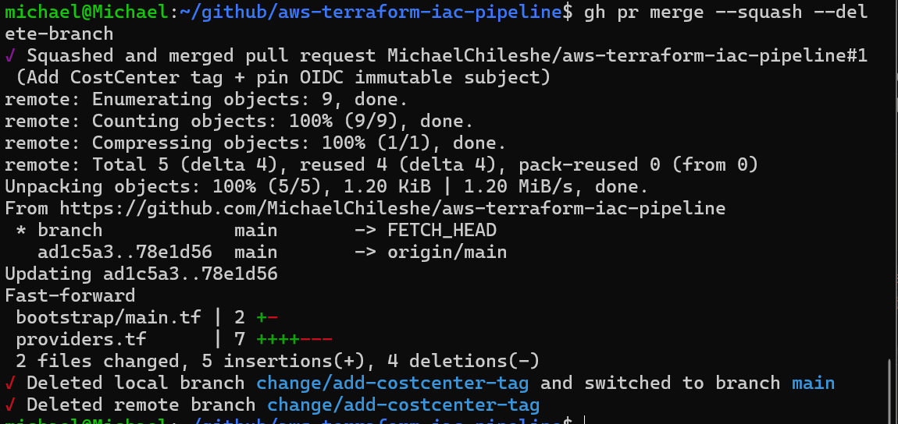

The merge triggered the apply-on-`main` run, which wrote the tag onto the live resources — a full change lifecycle with a reviewable diff and an audit trail, exactly what the auditor asked for.

---

## Teardown — back to $0

The whole environment comes down with one command, and I swept it the same day.

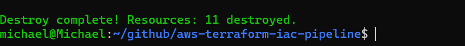
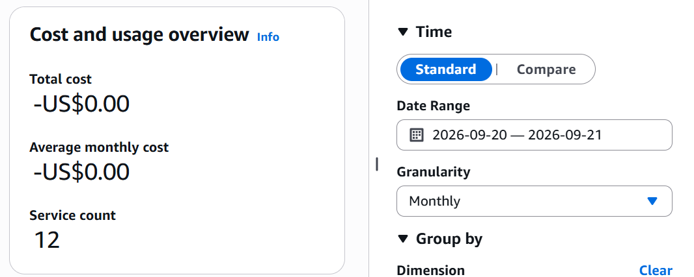

Cost Explorer confirmed the project's contribution at **–US$0.00**. (I left the near-free bootstrap resources — an empty-ish versioned state bucket, the free OIDC provider and IAM role — in place so the pipeline stays re-runnable.)

---

## Repository layout

```
aws-terraform-iac-pipeline/
├── README.md
├── .github/workflows/terraform.yml   # the CI/CD pipeline
├── .pre-commit-config.yaml           # local fmt/validate/tflint hooks
├── .tflint.hcl                        # TFLint AWS ruleset config
├── .gitignore
├── backend.tf                         # S3 remote state, native locking
├── providers.tf                       # provider + default tags + versions
├── main.tf                            # AMI lookup + calls the webapp module
├── variables.tf / outputs.tf
├── terraform.tfvars.example
├── bootstrap/                         # run ONCE: state bucket + OIDC role
│   ├── main.tf / variables.tf / outputs.tf / terraform.tfvars.example
├── modules/webapp/                    # the reusable infrastructure module
│   ├── main.tf / variables.tf / outputs.tf / versions.tf / user_data.sh.tftpl
└── docs/
    ├── architecture.md
    ├── pipeline.md
    ├── debugging-journey.md           # the OIDC → CloudTrail → immutable-subject story
    ├── adr/ (ADR-001 … ADR-005)
    └── screenshots/                   # build → OIDC debug → PR flow → teardown
```

---

## How to run it

Prerequisites: Terraform ≥ 1.10, AWS CLI configured, a GitHub repo. The short version:

```bash
# 1. Bootstrap the state bucket + OIDC role (once, local state)
cd bootstrap
cp terraform.tfvars.example terraform.tfvars   # set your github_owner
terraform init && terraform apply
#   note the two outputs: state_bucket and github_actions_role_arn

# 2. Deploy the stack locally to verify
cd ..
cp terraform.tfvars.example terraform.tfvars    # set your admin_cidr (your IP/32)
terraform init                                   # uses the S3 backend
terraform plan && terraform apply
#   open the web_url output — the page says "deployed by Terraform"

# 3. Wire the pipeline: put the role ARN in .github/workflows/terraform.yml,
#    set the ADMIN_CIDR repository variable, push, open a PR, watch it plan,
#    merge, watch it apply.

# 4. Tear it all down — one command
terraform destroy
```

> **Note on OIDC subjects:** if your GitHub account enforces immutable subjects, the trust policy's `sub` must match the `repo:OWNER@<id>/REPO@<id>:*` form — this repo uses `repo:${var.github_owner}@*/${var.github_repo}@*:*`, which matches both the immutable and plain formats. Check yours with `gh api repos/OWNER/REPO/actions/oidc/customization/sub`. The [debugging journey](docs/debugging-journey.md) explains why.

---

## Design decisions

Full records in [`docs/adr/`](docs/adr).

- **[ADR-001](docs/adr/ADR-001-terraform-over-cloudformation.md) — Terraform over CloudFormation.** Cloud-agnostic, larger ecosystem, the module/registry model.
- **[ADR-002](docs/adr/ADR-002-oidc-over-access-keys.md) — OIDC over stored access keys.** No long-lived secrets in GitHub; short-lived, repo-scoped credentials.
- **[ADR-003](docs/adr/ADR-003-s3-native-locking.md) — S3 native state locking over DynamoDB.** One less resource to manage on Terraform ≥ 1.10.
- **[ADR-004](docs/adr/ADR-004-plan-on-pr-apply-on-merge.md) — Plan on PR, apply on merge.** The diff is reviewed before it's applied — the auditable change flow.
- **[ADR-005](docs/adr/ADR-005-immutable-oidc-subject.md) — Pin the trust policy to the immutable OIDC subject.** Match the ID-based subject my account enforces; more secure, survives renames.

---

## What I'd do differently

- **Least-privilege the pipeline role.** It currently holds `ec2:*` and `s3:*` for the lab — which Checkov correctly flags in the scan. The production version scopes those to the exact actions and resource ARNs Terraform touches, ideally generated from the plan.
- **Add a manual approval gate before apply.** A GitHub Environment with a required reviewer would put a human "go" between merge and `apply` for production.
- **Multi-environment with workspaces or directories.** `dev`/`staging`/`prod` from the same module, each with its own state key and its own approval rules.
- **Make Checkov a hard gate for the findings that matter.** It runs `soft_fail` today so lab-intentional findings (public web SG, broad role) don't block. In production I'd allow-list those specific rules and fail the build on anything new.
- **Drift detection.** A scheduled `terraform plan` that alerts if the live environment has drifted from code — catching the exact click-ops problem this project set out to kill.
