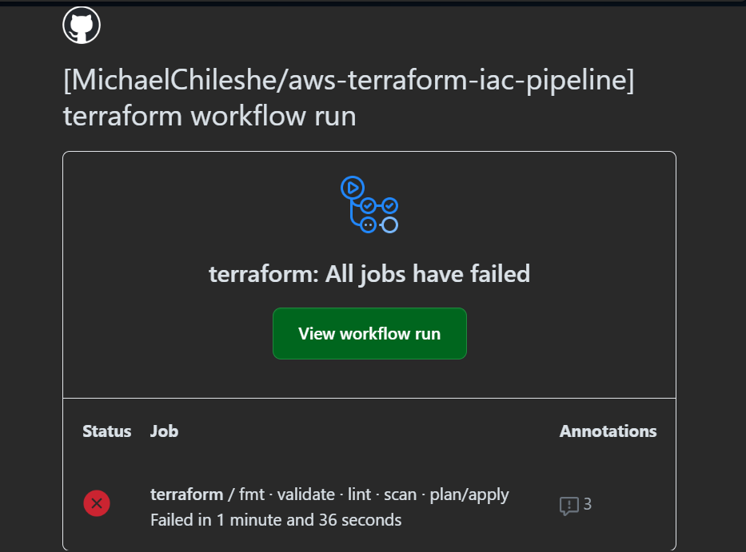
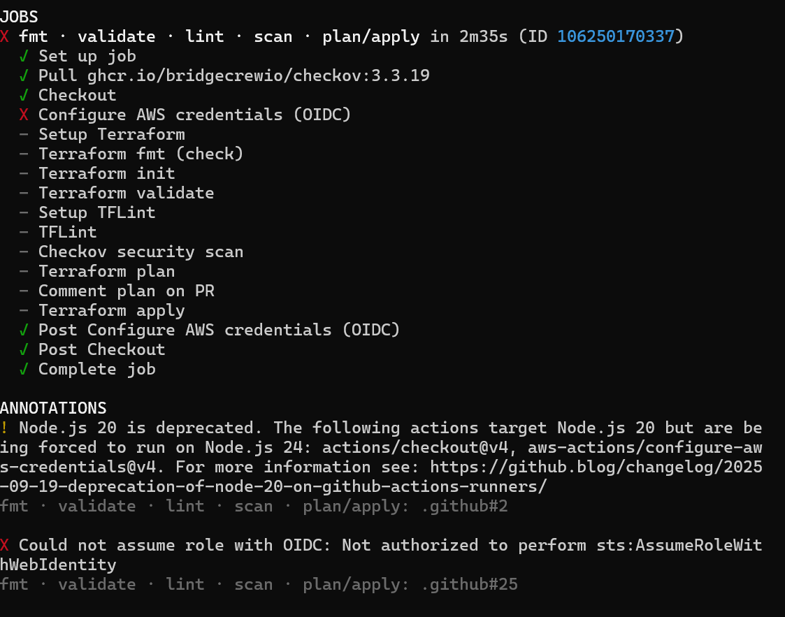
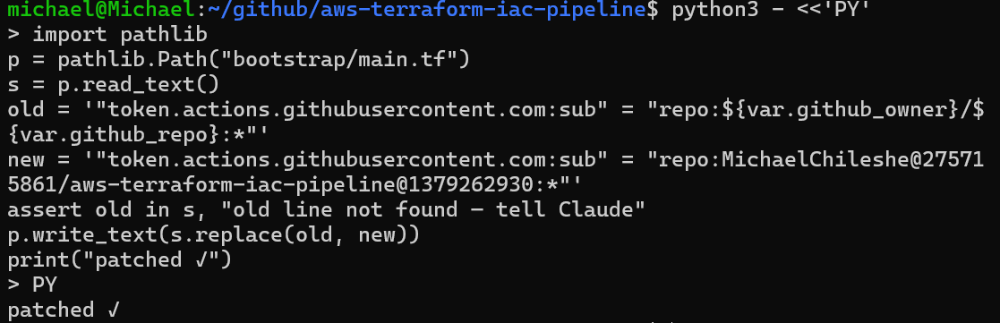
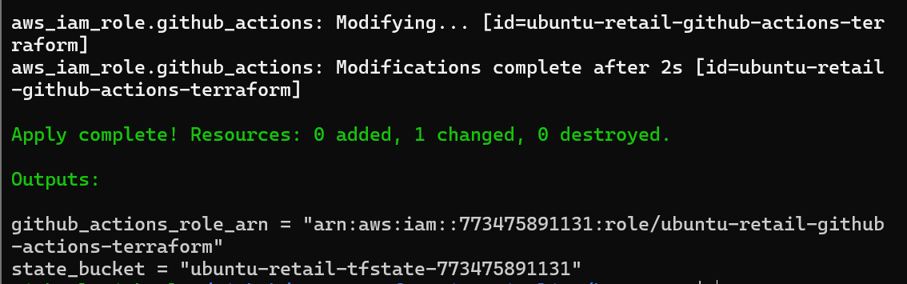

# Debugging journey — an OIDC `AccessDenied` traced to immutable subject claims

> The pipeline's very first run failed on the one step that matters most: exchanging a GitHub OIDC token for AWS credentials. Every part of the config looked correct. This is how I traced it — through CloudTrail — to a GitHub security feature I didn't know my account had turned on, and why the fix left the trust policy *more* secure than where it started.

This is the part of the project I'm proudest of, because nothing about it was in the happy path. The keyless-auth setup is the whole point of the pipeline, and when it broke, the error gave me almost nothing to go on. I had to reason about who was actually rejecting the request, and prove it with primary evidence rather than guesses.

---

## The failure

I pushed the initial commit to `main`. The pipeline started, and died on **Configure AWS credentials (OIDC)**:

```
Could not assume role with OIDC: Not authorized to perform sts:AssumeRoleWithWebIdentity
```




The step breakdown told me exactly where I was: checkout succeeded, then `Configure AWS credentials (OIDC)` got the ❌ and everything after it was skipped. So the runner *did* reach AWS and present a token — this wasn't "no token was minted." AWS's STS looked at the token, checked my role's trust policy, and said no.

## Ruling things out, one at a time

`AccessDenied` on `sts:AssumeRoleWithWebIdentity` almost always means the role's trust policy didn't match the token. So I verified every link in the chain against the live AWS resources — not against what I *thought* I'd deployed.

**The trust policy's conditions:**

```json
{
  "StringEquals": { "token.actions.githubusercontent.com:aud": "sts.amazonaws.com" },
  "StringLike":   { "token.actions.githubusercontent.com:sub": "repo:MichaelChileshe/aws-terraform-iac-pipeline:*" }
}
```

Correct — right audience, right repo, right case.

**The OIDC provider** — exactly one, correct ARN, `ClientIDList` contained `sts.amazonaws.com`, and the role's `Federated` principal pointed at that exact provider. All correct.

**The GitHub side** — `gh repo view --json nameWithOwner` returned `MichaelChileshe/aws-terraform-iac-pipeline`, character-for-character identical to the trust policy. IAM matches case-sensitively, so I was specifically checking for a `MichaelChileshe` vs `michaelchileshe` trap. There wasn't one.

I even re-ran the pipeline after everything had settled, in case it was IAM propagation on the first-ever token exchange. Same failure. So it wasn't timing either.

Every field I could see was correct, and it still failed. That's the moment to stop looking at the config and go to the source of truth for *why* AWS said no.

## CloudTrail — the primary evidence

STS records every `AssumeRoleWithWebIdentity` attempt, success or failure, in CloudTrail's 90-day event history. I pulled the recent ones:

```bash
aws cloudtrail lookup-events \
  --lookup-attributes AttributeKey=EventName,AttributeValue=AssumeRoleWithWebIdentity \
  --region us-east-1 --max-results 5
```

The `userIdentity` on the failed events showed the **actual `sub` the token presented**:

```
repo:MichaelChileshe@275715861/aws-terraform-iac-pipeline@1379262930:ref:refs/heads/main
```

There it was. The token's subject wasn't `repo:MichaelChileshe/aws-terraform-iac-pipeline:...` — it was `repo:MichaelChileshe@275715861/aws-terraform-iac-pipeline@1379262930:...`, with my numeric **account ID** and **repository ID** baked in. My trust policy's `StringLike` of `repo:MichaelChileshe/aws-terraform-iac-pipeline:*` never matched, because right after `MichaelChileshe` the real subject had `@275715861`, not `/`.

## The root cause: immutable subject claims

I checked the repo's OIDC subject customization:

```bash
gh api repos/MichaelChileshe/aws-terraform-iac-pipeline/actions/oidc/customization/sub
```

```json
{
  "use_default": true,
  "use_immutable_subject": true,
  "sub_claim_prefix": "repo:MichaelChileshe@275715861/aws-terraform-iac-pipeline@1379262930"
}
```

`use_immutable_subject: true`. My account enforces **immutable OIDC subjects** — a GitHub security feature that embeds the numeric owner and repo IDs into every token's `sub`. Even with `use_default: true`, the subject carries the IDs. Those IDs never change, even if the repo or account is renamed, which is the whole point: a trust policy pinned to them can't be hijacked by someone who registers a freed-up handle. Nobody had misconfigured anything — the config was written for the name-based subject format, and my account issues the ID-based one.

This is exactly why the field-by-field check came up clean: the mismatch lived in a claim only AWS could see, not in any resource I could read.

## The fix — embrace it, don't fight it

The right move was to make the trust policy match the format my account actually issues, and keep infrastructure-as-code as the source of truth. I re-parameterised the `sub` condition to use wildcards for the immutable IDs:

```hcl
"token.actions.githubusercontent.com:sub" = "repo:${var.github_owner}@*/${var.github_repo}@*:*"
```



The `@*` matches the numeric IDs without hardcoding them, while still pinning to my exact owner login and repo name — a GitHub token from any other repo still can't assume the role. I re-applied the bootstrap so the deployed role matched the code:



```
aws_iam_role.github_actions: Modifications complete after 2s
Apply complete! Resources: 0 added, 1 changed, 0 destroyed.
```

Re-ran the pipeline, and **Configure AWS credentials (OIDC)** went green. The rest of the pipeline followed.

## What I took from it

- **When every field looks right, stop trusting the config and get the primary evidence.** The AWS console and my Terraform both showed a correct setup. CloudTrail showed the one thing neither could: the actual claim AWS rejected. One `lookup-events` call ended an hour of guessing.
- **`AccessDenied` on `AssumeRoleWithWebIdentity` is a *matching* problem, not a *permissions* problem.** The role's inline permissions were never the issue — the trust policy's `Condition` was. Knowing which of the two is failing narrows the search enormously.
- **Immutable subjects are a feature, not a bug.** Pinning to IDs that survive a rename is genuinely more secure than pinning to names. The fix didn't weaken anything; it aligned the trust policy with a stronger identity model my account already enforces.
- **Keep the fix in code.** I fixed it by editing the bootstrap and re-applying, not by hand-patching the role in the console — otherwise the code would have drifted from reality, which is the exact click-ops problem this whole project exists to kill.
